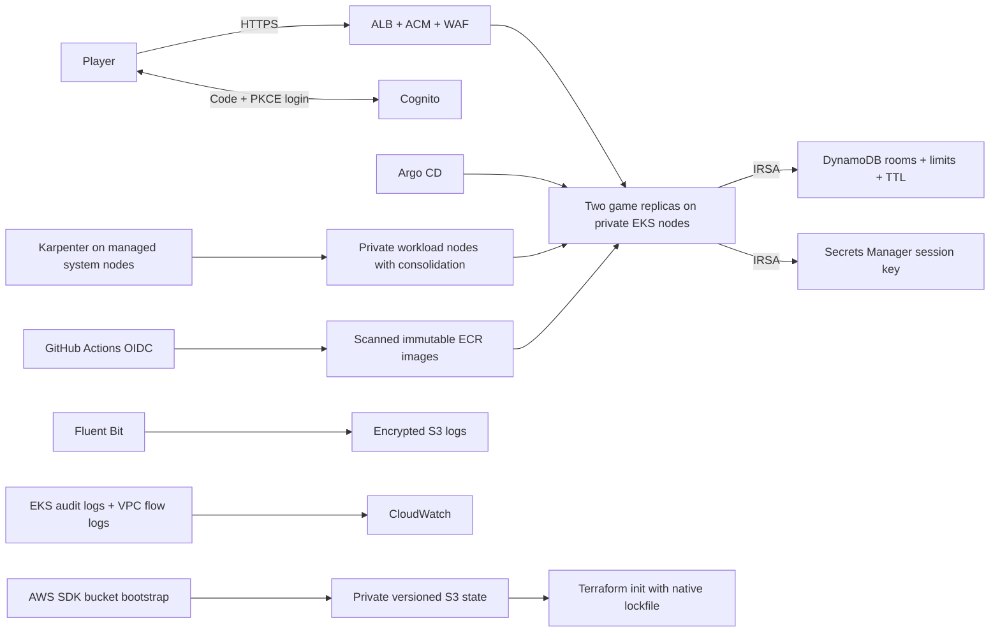

# Architecture

Two AZs, public ALB subnets and private node subnets. Dev has one NAT gateway, prod one per AZ. S3 and DynamoDB gateway endpoints avoid NAT for those services; other AWS HTTPS APIs use NAT. EKS API access is private unless administrator CIDRs are explicitly provided.

Cognito login is implemented once, in the application. Signed, secure HttpOnly cookies carry the session; PKCE/state/nonce and issuer/audience/expiry checks protect login. DynamoDB conditional writes serialize room transitions across workers. The same Secrets Manager session key is loaded by all replicas at startup.
