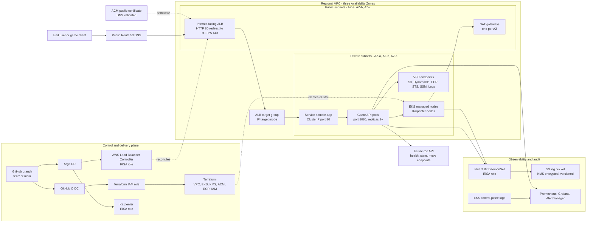
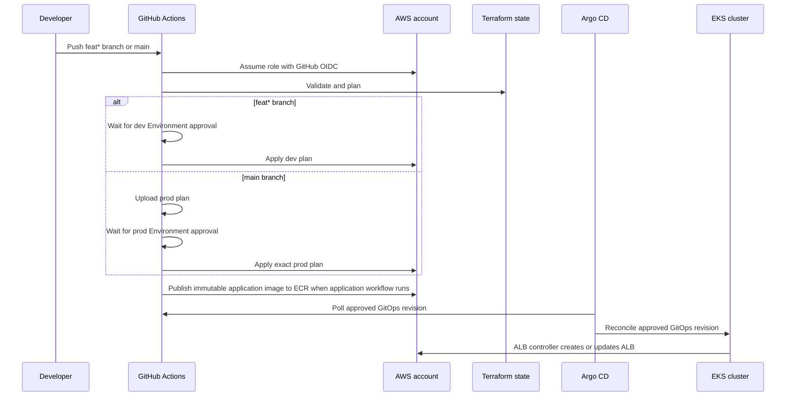

# Low-Level Architecture

Each environment is an isolated regional EKS platform. Dev runs in `ap-southeast-1` and prod runs in `us-east-1`. Each VPC spans three Availability Zones with public subnets for load balancers, private subnets for nodes and pods, one NAT gateway per AZ, and private AWS service endpoints.

## End-user request and deployment design

## Request path

1. A client resolves the application hostname through a public Route 53 record.
2. The internet-facing ALB accepts HTTP and HTTPS traffic in public subnets across the three AZs.
3. ACM provides the public certificate. HTTP is redirected to HTTPS by the Ingress annotation.
4. The AWS Load Balancer Controller reads `gitops/apps/sample-app/ingress.yaml` and maintains an IP target group from the Kubernetes Service endpoints.
5. The ALB sends traffic directly to healthy pod IPs in private subnets through the `sample-app` Service.
6. The pods serve the game API on port `8080`; readiness and liveness use `/healthz`.
7. Fluent Bit collects container logs and writes them to the encrypted S3 log bucket through its IRSA role.

## Network and security boundaries

| Boundary | Implementation |
| --- | --- |
| Internet to AWS | Route 53 DNS, public ALB, ACM certificate, HTTP to HTTPS redirect |
| Public to private | ALB target group reaches pod IPs; nodes have no public IP requirement |
| Worker egress | Multi-AZ NAT gateways plus private S3, ECR, STS, SSM, EC2 Messages, and Logs endpoints |
| AWS API access from pods | IRSA; ALB controller and Fluent Bit use dedicated roles |
| Kubernetes workload | Non-root container, read-only filesystem, dropped capabilities, probes, resource limits, and NetworkPolicy |
| Secrets and data | EKS secrets, ECR, and S3 logs use the customer-managed KMS key |
| CI/CD access | GitHub OIDC short-lived credentials; no long-lived AWS keys |
| Production change | `main` only, reviewed Terraform plan, and protected GitHub `prod` Environment |

## Infrastructure ownership

- Terraform creates the VPC, subnets, NAT gateways, VPC endpoints, EKS cluster, managed nodes, KMS key, ACM certificate, ECR repository, S3 log bucket, and IAM roles.
- Argo CD installs the AWS Load Balancer Controller, Karpenter, cert-manager, metrics-server, Prometheus, Grafana, Alertmanager, Fluent Bit, and the application manifests.
- Kubernetes owns the application Service, Ingress, Deployment, ServiceAccount, and NetworkPolicies.
- The AWS Load Balancer Controller owns the runtime ALB, listeners, target groups, and security-group rules generated from the application Ingress.

## Delivery flow

## Important current limitations

- ArenaGrid game state is stored in encrypted DynamoDB with point-in-time recovery; WebSocket presence and matchmaking remain future extensions.
- WAF and per-IP rate limiting are configured; authentication and authorization for mutation endpoints remain required before broad public exposure.
- Pod replicas are enabled, but strict cross-AZ placement requires topology spread constraints and a PodDisruptionBudget.
- The EKS API is private by default and should use approved administrator CIDRs only when public access is operationally required.
